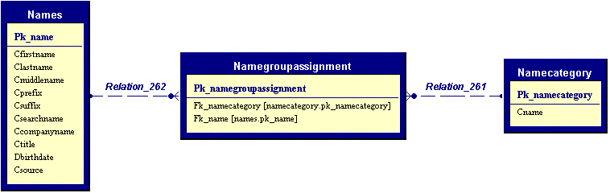

# Creating a Collection of Cross Referenced Child Entities

In many scenarios, entities are assigned references to other entities. For instance, a name record could be cross-referenced to some type of category or group as illustrated here:



In this example, we have a Names table with potentially a very large number of records. On the other side of the equation, we have a probably very limited list of categories that name can be assigned to (such as "Enterprise Customer", "Small Business", "Private Person", or whatever else might be applicable for the given application). In the middle, we have the entity that links each customer to any number of categories. The opposite is true as well: Any given category can be assigned to a large number of names.

While this is not a truely complex scenario, it also isn't entirely trivial, and generally a pain to handle. Naturally, it is the goal of the Milos Framework to simplify these types of constructs. Rather than having to deal with all three entities separately, we desire a more straightforward syntax. Something along these lines:

```cs
using (var name = new NameEntity())
{
    name.Categories.Add("Enterprise Customer");
    name.Categories.Add("Private Person");
    Console.WriteLine(name.Categories.Count);
    Console.WriteLine(name.Categories[0].Name);
}
```

In this scenario, we assume that the categories "Private Person" and "Enterprise Customer" already exist in the categories table. Note that we do not actually modify the categories table itself or add any new categories there. We simply assign those categories to the name. To achieve that, the "Categories" collection needs to create and maintain the cross-reference table. Note however, that although the modified and managed data is in the cross-reference table, the actual properties on each of the collection items is retrieved from the categories table (the "Name" property in this example). This means that the Categories collection (and the individual items within that collection) really need to handle two separate (although related) tables.

## Implementing the Collection

The implementation of an x-link collection is fundamentally very similar to the implementation of any other collection. Surprisingly however, it is actually somewhat easier to create x-link collections than one-to-many collections. The basic ideas are straightforward:

## Create a new collection class named NameCategoryXLinkCollection

1. Add a constructor that takes a reference to the parent entity as a parameter.
2. Change the class so it inherits from `Milos.BusinessObjects.EntityXlinkSubItemCollection`. Note that this is a different parent class than we use for normal collections. This class has almost all the functionality needed to implement x-link collections.
3. As in all entity collection classes, we need to override the ``etItemObject()` method to instantiate a new type of item (which we will create below).
4. Override the `Configure()` method to set configuration fields within the object.
5. We now also need to override the object's indexer, which will allow us to access sub-items by ID. (Like before... see HowTo_CreateChildItemsInEntities)


This is pretty much it! Here is the sample implementation for the database diagram shown above:

```cs
public class NameCategoryXLinkCollection : Milos.BusinessObjects.EntityXlinkSubItemCollection 
{
   public NameCategoryXLinkCollection (IBusinessEntity parentEntity) : base(parentEntity) {}

   protected override void Configure()
   {
      PrimaryKeyField = "pk_namecategoryassignment"; 
      ForeignKeyField = "fk_name"; 
      ParentTableName = "Names";
      ParentTablePrimaryKeyField = "pk_name";
      TargetForeignKeyField = "fk_namecategory";
      TargetPrimaryKeyField = "pk_namecategory";
      TargetTextField = "cName";
   }

   public override IEntitySubItemCollectionItem GetItemObject() => new NameCategoryBusinessItem(this);

   public new NameCategoryBusinessItem this[int index] => (NameCategoryBusinessItem)base[index];
}
```

## Implementing the Collection Item

Just like in all other sub-item collections, we need to implement collection item classes. However, most one-to-many-to-one collections tend to be rather simple. They often only provide a single field ("cName" in this case). This functionality is supported by default. However, it is still recommended that we create a new collection item class, so we are able to add custom fields later. Here's the code:

```cs
public class NameCategoryBusinessItem : Milos.BusinessObjects.EntitySubItemCollectionXLinkItem 
{
   public NameCategoryBusinessItem(IEntitySubItemCollection parentCollection) : base(parentCollection) {}
}
```

Yupp, that's it! At this point, we have a fully functional x-link collection. Assuming this collection was a member of a name entity object (see below...), we could now access the collection like so:

```cs
Console.WriteLine(nameEntity.Categories.Count);
nameEntity.Categories.Add("Private Person");
Console.WriteLine(nameEntity.Categories[0].Text);
```

Note that all x-link items have a Text property. This property returns whatever text is specified in the database field specified in the `TargetTextField` field (see `Configure()` method above).

> Note: This class also features an overridden `ToString()` method. The return value of `ToString()` is identical to the value of the Text property.

## Making the Main Entity Aware of the Sub Items

As for all collections, we have to make the main entity aware of the new collection. We can do this by overriding the `LoadSubItemCollections()` method of whatever entity we want this collection to be a member of (most likely the `NameEntity` in this example). Here's the code that is required:

```cs
public class NameEntity : BusinessEntity
{
   private NameCategoryXLinkCollection categories;
   public NameCategoryXLinkCollection Categories
   {
      get => categories;
   }

   protected override void LoadSubItemCollections()
   {
      categories = new NameCategoryXLinkCollection(this);
      categories.SetTable(InternalDataSet.Tables["namecategoryassignment"], InternalDataSet.Tables["namecategory"]);
   }
   //... more code here
```

Note that there is a main difference here between regular collections and x-link collections. For x-link collections, we need to pass the actual link table as well as the target table to the `SetTable()` method. After all, our collection needs to handle both tables.

Of course, this also means that these two tables have to be available in the first place. We can mae sure they are, by adding them to the business object

## Making the Business Object Aware of the New Tables

This is somewhat similar to what we do for regular collections. However, this time we have to handle the target table in addition to the table we actually manipulate (the "x-link" table). Here's how we would do that:

First, we need to add the tables to the `AddNew()` method of the `NameBusinessObject` class:

```cs
public override DataSet AddNew()
{
   var dsName = base.AddNew();
   NewSecondaryEntity("NameCategoryAssignment", dsName);
   QueryAllRecords("NameCategory", dsName);
   return dsName;
}
```

In addition to the default `AddNew()` actions, we also create a new secondary entity (table) for the x-link table. On top of that, we query all the existing records from the `NameCategory` table. Note that we do not want to add new category records. All we want to do is link to existing ones. That's why we load them all together, so we have them available to link to.

> Note: As you can immagine, this may be problematic when the target table is large. For instance, we wouldn't want to load all the customers into an x-link collection of an invoice object. That type of scenario would not be well suited for an x-link collection!

Additionally, we also have to make sure we load all the existing x-links whenever an existing name entity is loaded. Here's how that's done:

```cs
protected override void LoadSecondaryTables(Guid parentPk, DataSet existingDataSet)
{
   base.LoadSecondaryTables(parentPk, existingDataSet);

   QueryMultipleRecordsByKey("NameCategoryAssignment", "*", "fk_name", parentPk, existingDataSet);
   QueryAllRecords("NameCategory", existingDataSet);
}
```

Here, we simply query all linked records from the database based on the PK of the parent record. Then - once again - we load all the existing categories. Note the use of the `GetSingleRecordCommand()` method as well as the `GetAllRecordsCommand()` method, which are used to keep the query statements completely generic and database independent.

> Note: You may have noticed that the lines that loaded the existing categories are identical in both methods. It is also possible to create a method that performs the load of the categories, and then call that method. This makes for easier maintenance, and provides a single place to add or change behavior.

> Note: The above example shows the version used for business objects that are based on Guid primary keys. This is the most likely scenario. However, if the business object is based on another primary key type (such as an integer), the overload with the appropriate first parameter type needs to be overridden.

Finally, we also need to save the information in case any changes occured. To do so, we override the `Save()` method:

```cs
protected override bool SaveSecondaryTables(Guid parentPK, DataSet existingDataSet)
{
   var retVal = base.SaveSecondaryTables(parentPK, existingDataSet);
   if (retVal)
      retVal = this.SaveTable(existingDataSet.Tables["NameCategoryAssignment"], "pk_NameCategoryAssignment");
   return retVal;
}
```

Note that we only save the x-link table here. In most x-link collections, we only update the x-link table, but not the target table (although there are other scenarios where that is needed... see below). Therefore, all we have to do is save the link table.

## Advanced Topic: Exposing Additional Fields as Properties

Although many cross-linked tables have only very few fields, you will often encounter the need to expose more than just one property. For instance, the `NameCategory` table might have a `cDescription` field in addition to the cName field. In that case, we could simply add properties to the item class:

```cs
public class NameCategoryBusinessItem : EntitySubItemCollectionXLinkItem 
{
   public string Description
   {
      get => ReadFieldValue<string>("cDescription", XLinkItemAccessMode.TargetTable);
    }
}
```

There are two things worth pointing out here:

The field we are accessing is a member of the target table, and not the link-table. Since the link-table (`NameCategoryAssignment`) is the main table we are modifying and maintaining in this collection, a plain `GetFieldValue()` call would try to access the link table. To access the target table (`NameCategory`), we pass a secondary parameter (`XLinkItemAccessMode.TargetTable`). Note that in some scenarios we might want to expose additional fields from the main table (such as start and end-dates in a date-locked link). In that case, we could use the single-parameter version of `GetFieldValue()`.

This is a read-only property. We do not want to change the name of any categories (which would change the category name globally!). All we want is easy access. Therefore, do not create a Set method! (There are scenarios where we might want to update the target table, but we will discuss those below...)

Advanced Topic: Creating an X-Link Colletion with an Updatable Target Table
In some scenarios, it is desired that the target table gets updated. While it would be bad to change the name of a category that we cross-link to, there are scenarios where the cross-link target is a table that is in flux. For instance, the target table could store a list of addresses. Those addresses could be shared by multiple people. However, it may be acceptable to update those addresses for one name, and have all the other addresses be updated automatically.

Fundamentally, this type of collection works very similar. The main differnce is that read/write properties that access the target table are exposed through the entities. Also, whenever the target table is intended to be exposed to write operations, then by default, we would likely want to add a new record to the crosslink table as well as the target table. In other words. When we call `Name.Addresses.Add()`, we would add a cross-link record, as well as an actual address record ("target record").

We can easily indicate all of this to the collection class, by setting the `AutoAddTarget` property to true in the configuration method. So here is the code for the new configuration method:

```cs
public class NameCategoryXLinkCollection : EntityXlinkSubItemCollection 
{
   protected override void Configure()
   {
      PrimaryKeyField = "pk_placement";
      ForeignKeyField = "fk_name";
      ParentTableName = "Names";
      ParentTablePrimaryKeyField = "pk_name";
      TargetForeignKeyField = "fk_address";
      TargetPrimaryKeyField = "pk_address";
      AutoAddTarget = true;
   }
   ...
```

Note that in this case, the `TargetTextField` property does not have to be set (and it will be ignored if you do) since the assumption is that we are not just linking to a single-field table anymore. In other words: We expect this to be a much more sophisticated scenario. Therefore, we would now also add more properties to the items within the collection:

```cs
public class NameAddressBusinessItem : EntitySubItemCollectionXLinkItem 
{
   public string Street
   {
      get => ReadFieldValue<string>("cStreet", XLinkItemAccessMode.TargetTable?);
      set => WriteFieldValue("cStreet", value, XLinkItemAccessMode.TargetTable);
   }
}
```

Note that we need to indicate that we want to talk to the target table when using the `GetFieldValue()` and `SetFieldValue()` methods.

Note that often, it is also desired to automatically set initial values whenever a new item gets added. For instance, a new address could by assigned a default address type. This can by done through an overloaded `Add()` method:

```cs
// This is the same class as the one shown above
public class NameCategoryXLinkCollection : EntityXlinkSubItemCollection 
{
   public NameAddressEntity Add(AddressType type)
   {
      var entAddress = (NameAddressBusinessItem)Add();
      entAddress.TypeStrong = type;
      return entAddress;
   }
   //...
```

So the basic idea here is to let the default add behavior create a new entity, and then set properties once that entity is retrieved.
