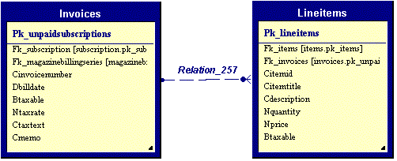

# Creating a Collection of Child Objects

Child entity objects are generally used to implement entities that are composed of multiple tables. A typical example would be an invoice and it's line items:

 

Another example would be a product entity that has a number of attached images stored in a related table.

Child collections may be implemented in either of two ways. The first, and most common way, is through generics. The second, less common, way is via a custom collection type. Since the generics method represents the main stream, it is described first below. Differences and additional activities required by the custom type method are described at the end of this topic.

> Note: In this example I assume we are adding a related table with product images and descriptions to our products database.

## Implementing the Collection Item

1. Create a new class called ```ProductImageBusinessItem``` as a subclass of ```Milos.BusinessObjects.EntitySubItemCollectionItem```
2. Add a constructor that takes a reference to the parent collection as a parameter.
3. Add a ```Label``` property that accesses the ```clabel``` field.
4. Add an ```Image``` property that accesses the ```iimage``` binary information and loads and saves bitmap objects from it.


Here's the code you should have at this point:

```cs
public class ProductImageBusinessEntity? : EPS.Business.BusinessObjects.EntitySubItemCollectionItem 
{ 
   public ProductImageEntity(IEntitySubItemCollection parentCollection) : base(parentCollection) 
   {} 

   public string Label 
   { 
      get => ReadFieldValue<string>("clabel");
      set => WriteFieldValue("clabel", value); 
   }

   public Bitmap Image
   {
      get
      {
        var imageBytes = ReadFieldValue<byte[]>("iimage");
        if (imageBytes.Length < 1) return null;

        var fileStream = new MemoryStream?();
        var writer = new BinaryWriter(fileStream);
        writer.Write(imageBytes);
        return new Bitmap(imageBytes);
      }

      set
      {
         var stream = new MemoryStream();
         value.Save(stream, System.Drawing.Imaging.ImageFormat.Jpeg);
         WriteFieldValue("iimage", stmFile.ToArray());
      }
   }
}
```

## Making the Main Entity Aware of the Sub Items

At this point, we have a fully functional child record (sub items) collection, but the main business entity is not yet aware of this object. Therefore, we have to add code that instantiates the new collection when the business entity instantiates.

1. Add an internal field of type ```Milos.BusinessObjects.Generic.GenericEntitySubItemCollection<ProductImageBusinessEntity>``` to the ```ProductBusinessEntity``` class
2. Expose the collection as a read-only property called ```ProductImages```.
3. Override the ```LoadSubItemsCollection``` method
4. Instantiate the collection object and pass a reference to the current entity as a constructor parameter.

You should now have added the following code to your ```ProductBusinessEntity``` class:

```cs
public class ProductBusinessEntity : Milos.BusinessObjects.BusinessEntity 
{ 
   private Milos.BusinessObjects.Generic.GenericEntitySubItemCollection<ProductImageBusinessItem> imagesCollection; 

   public Milos.BusinessObjects.Generic GenericEntitySubItemCollection<ProductImageBusinessItem> ProductImages
   {
      get => imagesCollections;
   } 

   protected override void  LoadSubItemCollections()
   {
      imagesCollection = new Milos.BusinessObjects.GenericEntitySubItemCollection<ProductImageBusinessItem>(this, "PK_ProductImage", "FK_Product", "Products", "PK_Product", GetInternalData().Tables["ProductImages"] );
   }

   // Rest of class continues as in the previous example 
```

## Making the Business Object Aware of the New Table

Note that in this example, we are using the ```productimages``` table, although the underlying business object does not at all load or save that table (by default it will only handle its own master entity... in this case "products"). Therefore, we have to add some functionality to the business object to handle this table.

1. Override the ```LoadSecondaryTables()``` method of the ```ItemBusinessObject``` class to executes its default behavior, but also load related methods from the ```ProductImages``` table into a new table in the data-set.
2. Override the ```SaveSecondaryTables()``` method to also save the new table.
3. Override the ```AddNewSecondaryTables()``` method to add a placeholder table for the product images to the dataset.

Your new business object code should be like this:

```cs
public class ItemBusinessObject : Milos.BusinessObjects.BusinessObject
{

   // Previously existing code goes here...

   // This method has changed from before!!!
   public override bool SaveSecondaryTables(Guid parentPk, DataSet existingDataSet) => SaveTable( existingDataSet.Tables["ProductImages"], "PK_ProductImage" );

   // This method has changed from before!!!
   public override void AddNewSecondaryTables(Guid parentPk, DataSet existingDataSet)
   {
      NewSecondaryEntity( "ProductImages", existingDataSet);
   }

   protected override void LoadSecondaryTables(Guid parentPk, DataSet existingDataSet)
   {
      QueryMultipleRecordsByKey( "ProductImages", "*", "FK_Product", parentPk, existingDataSet );
   }
}
```

Note the use of the ```BuildSingleRecordQueryCommand()``` method on the current ```DataService```. This is a generic way of querying a list of fields (all fields (*) in this example), from a certain table (```ProductImages```), who's identifying field (```product_fk```) equals a certain value (```parentPk```). ```LoadSecondaryTables``` should always use this method if possible, since it is the easiest way to create a completely database independent command.

## Using Non-Guid Primary Keys

The above version assumes that the business object is based on Guid primary keys. This is generally going to be the case, although in exceptional cases, integers or strings could be used. When using these types, the overall concept remains very similar. All the methods overridden above still need to be overridden. However, this time, the overloads with the appropriate first parameters types need to be overridden, rather than the Guid version. Here is a C# example for a business object that is based on integer types:

```cs
public class EmployeeBO : BusinessObject
{
   // Other class code goes here...

   protected override void LoadSecondaryTables(int parentPk, DataSet existingDataSet)
   {
      QueryMultipleRecordsByKey("employeeterritories", "*", "employeeid", parentPk, existingDataSet)
   }

   protected override bool SaveSecondaryTables(int parentPk, DataSet existingDataSet) => SaveTable(existingDataSet.Tables["employeeterritories"], "terrid");

   protected override void AddNewSecondaryTables(int parentPk, DataSet existingDataSet)
   {
      NewSecondaryEntity("employeeterritories", existingDataSet);
   }
}
```

As you can see, the code is almost identical, with the exception of the first parameter type of each method. Business objects that use string keys instead have to declare the first parameter as a string.

## Preserving Referential Integrity in Identity-Key Scenarios

Whenever a business entity (or business object) is based on integer primary keys that are automatically generated by the back end database, the client-side representation of newly created data uses temporary keys until it is saved the first time. Temporary keys are generally in the minus-range. Once the data is stored to the back end database server, the keys are replaced with the real keys. Milos will automatically handle that. However, in scenarios with multiple related tables ("child tables"), the foreign keys in related tables also need to be updated, which does NOT happen automatically. However, Milos provides a pre-defined place to make such updates.

> Example: Let's say we create a new customer record with two new orders. By default, the customer will receive the key -1, and the two orders will get the keys -1 and -2 respectively. Both order records have a foreign key of -1 that links to the customer record. Then, the customer record is stored to the database, which will create the permanent key, which is a value created by the server. This key could be any integer value, such as 2364. The same process will occur for the two orders. The problem at this point is that the orders still link to customer -1, which does not exist anymore. Therefore, the order table has to be updated manually. This can be done by overriding the PrimaryKeyValueChanged?() method in the business object:

```cs
public override void PrimaryKeyValueChanged(DataSet updatedDataSet, string tableName, int oldKey, int newKey)
{
   if (tableName == "customer")
      foreach (DataRow row in updatedDataSet.Tables["Orders"].Rows)
         row["primarykeyfield" ] = newKey;
}
```

> Note that this only applies whenever the business object is based on identity (integer) primary keys.

## Using Custom Types for Child Collections

As mentioned at the beginning of this topic, it is possible to use custom types rather than generic types to create child collections for as business entity.  When using custom types, you create the child business item class in exactly the same way.  In addition to doing this, you must create a collection class.  Lastly, in a similar, but slightly different, manner as that for generic collections, you must make the business entity aware of the child collection.  These two subtopics are described below.

## Implementing the Collection

1. Create a new class called ```ProductImagesCollection```
2. Add a constructor that takes a reference to the parent entity as a parameter.
3. Change the class so it inherits from ```Milos.BusinessObjects.EntitySubItemCollectionItem``` 
4. Note that this automatically adds an overrides for the ```GetItemObject()``` method. If this doesn't happen automatically, add it yourself. In this method, instantiate the class ```ProductImageEntity``` (see below) and return it.)
5. Note that there also is a ```Configure()``` method that has been added automatically. Set the ```PrimaryKeyField```, ```ForeignKeyField```, ```ParentTableName```, and ```ParentTablePrimaryKeyField``` properties in this method.
6. We now also need to override the object's indexer, which will allow us to access sub-items by ID.


Note that this functionality is already implemented in the base class. However, the base entity collection class deals with generic sub-item entities, while we are more interested in Product Image Entities. Therefore, we simply use the base class behavior, and type-case it's return value to the type we are creating in ```GetItemObject()```.

At this point, we can do anything we need to do with this sub-entity collection, except adding new entities in a meaningful fashion. Most likely, when we want to add a new image, we want to always add an image and a short description. Therefore, we need to add (overload) a new ```Add()``` method, with these parameters.

Use the ```AddNewRow()``` method to add a row to the internal data set, and then set the Label and Bitmap properties to the new value (see below);

At this point you should have the following code in your class:

```cs
using System.Drawing;
using System.IO

public class ProductImagesCollection : Milos.BusinessObjects.EntitySubItemCollection
{
   public ProductImagesCollection (IBusinessEntity parentEntity): base(parentEntity)
   { }

   protected override void Configure()
   {
      PrimaryKeyField = "PK_ProductImage?";
      ForeignKeyField = "FK_Product";
      ParentTableName = "Products";
      ParentTablePrimaryKeyField = "PK_Product";
   }

   public override Milos.BusinessObjects.EntitySubItemCollectionItem GetItemObject() => new ProductImageBusinessItem();

   public new ProductImageBusinessItem this[int index]
   {
      get => (ProductImageBusinessItem)GetItemByIndex(index);
   }

   // Add this method only if needed...
   public void Add(string label, Bitmap image)
   {
      var imageEntity  = (ProductImageBusinessItem)AddNewRow();
      imageEntity.Label = label;
      imageEntity.Image = image;
   }
}
```

## Making the Main Entity Aware of the Sub Items

At this point, we have a fully functional child record (sub items) collection, but the main business entity is not yet aware of this object. Therefore, we have to add code that instantiates the new collection when the business entity instantiates.

1. Add an internal field of type ```ProductImagesCollection``` to the ```ProductBusinessBusinessItem``` class.
2. Expose the collection as a read-only property called ```ProductImages```.
3. Override the ```LoadSubItemsCollection``` method.
4. Instantiate the collection object and pass a reference to the current entity as a constructor parameter.
5. Set the table that is used by this collection.

You should now have added the following code to your ```ProductBusinessEntity``` class:

```cs
public class ProductBusinessEntity : Milos.BusinessObjects.BusinessEntity
{
   private ProductImagesCollection imagesCollection;

   public ProductImagesCollection ProductImages
   {
      get => imagesCollection;
   }

   protected override void LoadSubItemCollections()
   {
      imagesCollection = new ProductImagesCollection(this);
      imagesCollection.SetTable(dsInternal.Tables["ProductImages"]);
   }

   // Rest of class continues as in the previous example
}
```
