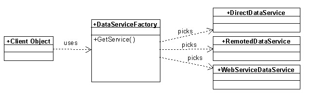

# Data Service Introduction

The Data Service object is used to execute basic data access command against a database back end. The Data Service object features methods such as ```ExecuteQuery()``` and ```ExecuteStoredProcedure()``` that pass commands to the database and may retrieve results.

While in theory, the data service can be used anywhere within an application, it is typically only used by business objects. Therefore, most developers will never directly talk to a data service object, unless they create a new breed of business object (or perform some very specialized programming tasks).

Data services are never created directly. Instead, a data service factory serves up a data service that is appropriate for the current application configuration. Whenever a developer chooses to use a data service directly, the data service factory class has to be used to gain access to the desired service.

## The Technology

The data service object is responsible for connecting to the back-end database in a generic and polymorphic fashion. The basic idea is to generically obtain a data service object based on the application configuration. The object will therefore be created by a data service factory.

The general idea is that there are different types of services that can be configured. One can use a strategy pattern to semi-dynamically pick the data service that is most appropriate:



The idea here is that the data service factory is configured to have a primary and a secondary service (or perhaps a whole chain). Normally, the direct data service would be the default service. The factory would instantiate that service and call a method on it to test the connection. If the connection fails, it would go to the secondary service, such as the remoted or the web service data service. Again, the factory tests the connection and proceeds if the connection passes.

## An Example

In this example, we assume that we want to access an SQL Server database that resides on a local server. We therefore can have the following settings in our configuration:

```xml
<xml version="1.0" encoding="utf-8" ?>
<configuration>
   <appSettings>
      <add key="DataServices" value="SqlDataService"/>

      <add key="database:UserName" value="devuser"/>
      <add key="database:Password" value="devuser"/>
      <add key="database:Server" value="(local)"/>
      <add key="database:Catalog" value="Northwind"/>
   </appSettings>
</configuration>
```

This provides all the configuration needed to let our data service infrastructure access a local SQL Server instance. We can thus access data in this fashion now:

```cs
using (var service = DataServiceFactory.GetDataService("database"))
using (var command = service.BuildAllRecordsQueryCommand("Customers", "*", "LastName"))
using (var dataSet = service.ExecuteQuery(command, "Cust"))
{
    Console.WriteLine(dataSet.Tables["Cust"].Rows[0][0]);
}
```

The first line creates an instance of the service and configures it with all the settings linked to the "database:" prefix. In this case, this gives us a data service that connects us to SQL Server and the Northwind database. (Note that the system could also be configured to use a completely different database, such as Oracle, or CosmosDB).

Line two gives us a command object that queries all records from the Customers table, and includes all fields (*) and sets the sort-order to "LastName". The next line then executes that query, creates a ```DataSet``` object and adds a table named "Cust" (in most scenarios that would be the same as the SQL table name, but this example aims to show that it can be different). The following code can then access and update information in that table.

> Note that this is a somewhat low-level way of accessing the database. The business object layer provides another layer of abstraction. In a business object, essentially the same code is available using the ```GetList()``` method.

Note that it is possible to configure the system with different data services to create a fail-over chain:

```xml
<add key="DataServices" value="SqlDataService, WsSqlDataService"/>
```

In this case, the system will first try to make a connection to a local instance of SQL Server using the ```SqlDataService``` object. If that fails (perhaps because the user has no local access to the configured SQL Server instance), then it will try to use the next option in the list, which is ```WsSqlDataService```. This service accesses SQL Server over a web-based service. It is easy to imagine other examples as well. For instance, one could use offline cache databases and the like.

It is of course also possible to query data in different ways. Consider this example:

```cs
using (var service = DataServiceFactory.GetDataService("database"))
using (var command = service.NewCommandObject())
{
    command.CommandText = "SELECT Id, FirstName, LastName FROM Customers WHERE LName LIKE @Name";
    var parameter = service.NewCommandObjectParameter("@Name", "Egger%");
    command.Parameters.Add(parameter);
    using (var dataSet = service.ExecuteQuery(command, "Cust"))
    {
        Console.WriteLine(dataSet.Tables["Cust"].Rows[0][0]);
    }
}
```

In this example, a custom query with added parameters (using the parameters collection for injection-safety) is executed to retrieve data.

These are just two examples of how to use the data services directly to access data. There are a number of additional methods that can be explored that run various types of queries and even update data. Note, however, that it is generally easier to use business objects (which in turn use this data service infrastructure) to access data, as business objects create a higher level of abstraction for easier use. For instance, querying all data in a table can be done with every business object like this:

```cs
using (var biz = new CustomerBusinessObject())
using (var ds = biz.GetList())
{
    // Do something with the data here...
}
```

Similarily, a new method that queries customers by name can be added to a business object like this:

```cs
public DataSet GetCustomersByLastName(string lastName)
{
    using (var command = NewDbCommand("SELECT * FROM Customers WHERE LName LIKE @Name")
    {
        AddCommandParameter(command, "@Name", lastName);
        return ExecuteQuery(command);
    }
}
```

As you can see, this hides much of the complexity, although, it uses exactly the same infrastructure under the hood. Note, that this setup provides very generic database access. The code shown here can run against a variety of databases (local or remote) without change. (Note that the exact query syntax may not work with all databases, although the example shown here can be executed by Milos against all supported databases, as Milos can handle syntax differences and "patch up" the provided command as needed).
